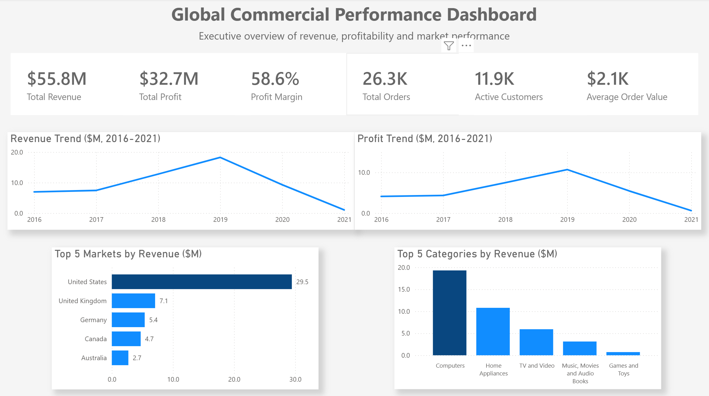
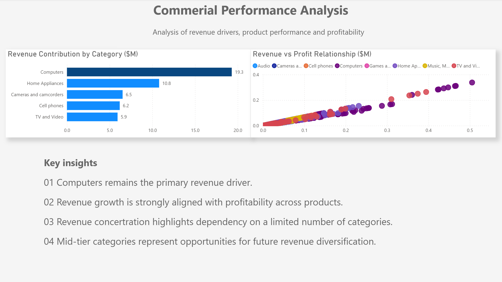
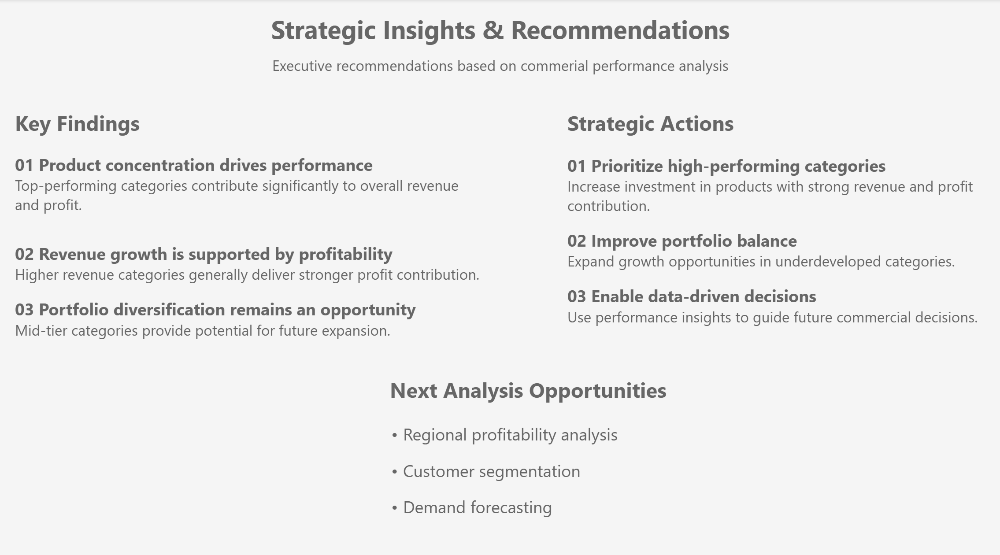
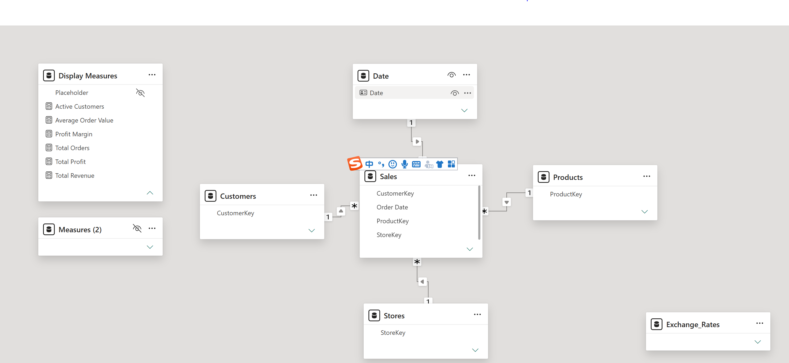

# Global Commercial Performance Dashboard

An end-to-end Business Intelligence project analyzing global commercial performance using SQL, Power BI, and data-driven business analysis.

This project explores revenue drivers, product performance, profitability patterns, and commercial growth opportunities through interactive dashboards and business-focused analytical workflows.

---

# Project Overview

This project simulates a real-world commercial analytics scenario for a global electronics retailer.

The objective is to evaluate business performance, identify key revenue drivers, analyze profitability across products and markets, and generate actionable recommendations to support future commercial growth.

---

# Business Objectives

- Identify key revenue drivers and performance trends.
- Evaluate product and category profitability.
- Assess revenue concentration across markets.
- Discover commercial growth opportunities.
- Deliver data-driven business recommendations.

---

# Business Questions

The analysis addresses the following commercial questions:

1. How is the company performing across its core commercial KPIs?
2. How has revenue changed over time?
3. Which products generate the highest revenue?
4. Which products generate the highest profit?
5. Which categories deliver the strongest revenue, profit, and margin performance?
6. Which markets generate the greatest business value?
7. Which customers contribute the highest business value?
8. Which locations operate most efficiently?
9. What factors drive sales performance across different markets?

---

# Dashboard Preview

## Executive Overview



---

## Commercial Performance Analysis



---

## Strategic Insights & Recommendations



---

# Key Findings

- Computers represent the largest revenue contributor across product categories.
- Revenue growth is strongly associated with profitability performance.
- Commercial performance is concentrated among a limited number of categories and markets.
- Mid-tier categories provide opportunities for portfolio diversification and future growth.

---

# Strategic Recommendations

Based on the analysis, the project identifies several business actions:

- Prioritize investment in high-performing product categories.
- Improve portfolio balance by expanding growth opportunities in underdeveloped categories.
- Use commercial performance insights to support data-driven decision-making.

---

# End-to-End Workflow

```text
Raw Data
    │
    ▼
Power Query (Data Cleaning & Transformation)
    │
    ▼
Data Modeling (Star Schema)
    │
    ▼
DAX Measures & KPI Development
    │
    ▼
SQL Business Analysis
    │
    ▼
Interactive Power BI Dashboard
    │
    ▼
Business Insights & Strategic Recommendations
```

---

# Tech Stack

- SQL
- Power BI
- DAX
- Power Query
- Excel

---

# Data Model

The dashboard is built using a star schema, with Sales as the central fact table connected to multiple dimension tables including Customers, Products, Stores, and Date.

The model supports scalable KPI calculations, business performance analysis, and interactive reporting using DAX measures.



---

# SQL-Driven Business Analysis

The project includes SQL-driven analysis covering key commercial questions.

| Analysis Area | Business Question |
|---|---|
| Executive Performance | How is the company's overall commercial performance? |
| Revenue Trend Analysis | How has revenue changed over time? |
| Product Revenue Analysis | Which products generate the highest revenue? |
| Product Profitability Analysis | Which products generate the highest profit? |
| Category Performance Analysis | Which categories deliver the strongest revenue, profit, and margin? |
| Geographic Performance Analysis | Which markets generate the greatest business value? |
| Customer Value Analysis | Which customers contribute the highest business value? |
| Store Productivity Analysis | Which locations operate most efficiently? |
| Sales Driver Analysis | What factors drive sales performance across markets? |

Detailed SQL queries are available in the `/sql` directory.

The SQL analysis focuses on:

- Translating business questions into analytical queries.
- Applying SQL techniques including aggregations, joins, CTEs, and window functions to answer business problems.
- Identifying revenue drivers, profitability patterns, and growth opportunities.
- Supporting data-driven commercial decisions.
